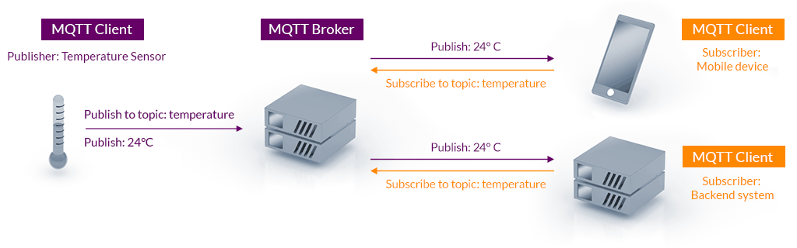
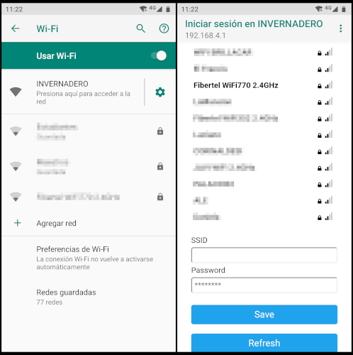

# ESMET IoT

ESMET IoT es un proyecto que intentaba iniciar el proceso de automatización (post pandemia Covid-19) del [invernadero hidropónico](http://regionatlantica.com/esmet-no-1-formacion-tecnica-de-excelencia-en-mar-del-plata-que-busca-asesora-a-productores-en-hidroponia/) de la Escuela Secundaria Municipal de Educación Técnica N°1 de la ciudad de Mar del Plata, mediante el desarrollo y construcción de un dispositivo IoT experimental de bajo costo para monitoreo de la temperatura ambiente.

*Invernadero ESMET N°1, diciembre de 2020*.

El proyecto consiste en una interfaz IoT conformada por hardware y software. El hardware esta basado en una placa NodeMCU (SoC ESP8266), junto a un par de sensores de temperatura y, de manera opcional, humedad ambiente. Este bloque es el encargado de recoger los datos, procesarlos y enviarlos a un broker MQTT alojado en Internet. 

Por su parte el software que conformará el panel de control se desarrollará en Python + Django + JavaScript y en una primera instancia contará con una interfaz de usuario web donde se visualizará:

- Gráfica tiempo / temperatura
- Historial de registros
- Lecturas de valor en tiempo real

El sistema es escalable, es decir, que en una etapa futura será posible añadir características. Por ejemplo: 

- Etapas de control de potencia
- Sistema de alarma
- Recepción de comandos 

## Arquitectura del sistema

*Arquitectura de un sistema basado en MQTT. Imagen [MQTT.org](https://mqtt.org/).*

## Hardware

El dispositivo está basado en el SoC ESP8266 junto a un par de sensores [DS18B20](./docs/DS18B20.pdf) que serán los encargados de registrar le temperatura ambiente del recinto. Posee un switch interno para reiniciar la configuración WiFi y un [sensor tamper](https://www.tecnoseguro.com/faqs/alarma/que-es-el-tamper-en-un-sistema-de-alarma) para evitar que se manipule el gabinete sin autorización. Además posee tres LEDs indicadores: energía (*POWER*), estado de la conexión WiFi (*ONLINE*) y estado del tamper del gabinete (*ALARMA*).

*Diagrama esquemático.*

Respecto a los sensores DS18B20, hay que tener en cuenta el valor de la resistencia pull-up que está conectada en el bus de datos (*pin DQ*). La siguiente tabla brinda una estimación del valor de acuerdo a la longitud del cable del bus. 

Al iniciar el sistema se genera una red WiFi interna que permite ingresar las credenciales necesarias para poder conectarse a Internet, esto se logra gracias a la biblioteca [*WiFiManager*](#firmware). Una vez realizada la conexión a la red WiFi, se inicia el proceso para conectarse al broker MQTT, en este caso se utiliza un servidor público. 

*Conectandóse a la red WiFi.*

Una vez iniciado, el sistema registra el estado del sensor tamper y de ambos sensores cada cierto período de tiempo y realiza la publicación en un *topic* especifico del broker mqtt.

## Firmware

El firmware está escrito utilizando la API de Arduino, y para compilar necesita las siguientes dependencias:

- [Arduino Library for Maxim Temperature Integrated Circuits](https://github.com/milesburton/Arduino-Temperature-Control-Library)
- [OneWire](https://www.pjrc.com/teensy/td_libs_OneWire.html)
- [PubSubClient](https://pubsubclient.knolleary.net/)
- [WiFiManager](https://github.com/tzapu/WiFiManager/)

## Recursos

- [Alumnos de la Esmet desarrollan una novedosa técnica de cultivo sin suelo](https://www.0223.com.ar/nota/2022-9-7-9-42-0-alumnos-de-la-esmet-desarrollan-una-novedosa-tecnica-de-cultivo-sin-suelo)
- [Alumnos de la ESMET continúan con el desarrollo de proyectos productivos](https://www.mardelplata.gob.ar/Noticias/alumnos-de-la-esmet-continuan-con-el-desarrollo-de-proyectos-productivos)
- [DS18B20 sensor de temperatura para líquidos con Arduino](https://programarfacil.com/blog/arduino-blog/ds18b20-sensor-temperatura-arduino/)
- [MaQiaTTo MQTT Broker](https://maqiatto.com/)

## Licencia

Este trabajo está protegido por la **Licencia MIT**. Puedes acceder a la versión original de la licencia (en inglés) a través del archivo [LICENSE](./LICENSE) o en línea en [The MIT License (MIT)](https://mit-license.org/). También proporcionamos una traducción no oficial desde [Wikipedia](https://es.m.wikipedia.org/wiki/Licencia_MIT#La_licencia):

Copyright (c) 2024 Lucas Martín Treser

Por la presente se concede permiso, libre de cargos, a cualquier persona que obtenga una copia de este software y de los archivos de documentación asociados (el "Software"), a utilizar el Software sin restricción, incluyendo sin limitación los derechos a usar, copiar, modificar, fusionar, publicar, distribuir, sublicenciar, y/o vender copias del Software, y a permitir a las personas a las que se les proporcione el Software a hacer lo mismo, sujeto a las siguientes condiciones:

El aviso de copyright anterior y este aviso de permiso se incluirán en todas las copias o partes sustanciales del Software.

EL SOFTWARE SE PROPORCIONA "COMO ESTÁ", SIN GARANTÍA DE NINGÚN TIPO, EXPRESA O IMPLÍCITA, INCLUYENDO PERO NO LIMITADO A GARANTÍAS DE COMERCIALIZACIÓN, IDONEIDAD PARA UN PROPÓSITO PARTICULAR E INCUMPLIMIENTO. EN NINGÚN CASO LOS AUTORES O PROPIETARIOS DE LOS DERECHOS DE AUTOR SERÁN RESPONSABLES DE NINGUNA RECLAMACIÓN, DAÑOS U OTRAS RESPONSABILIDADES, YA SEA EN UNA ACCIÓN DE CONTRATO, AGRAVIO O CUALQUIER OTRO MOTIVO, DERIVADAS DE, FUERA DE O EN CONEXIÓN CON EL SOFTWARE O SU USO U OTRO TIPO DE ACCIONES EN EL SOFTWARE.
